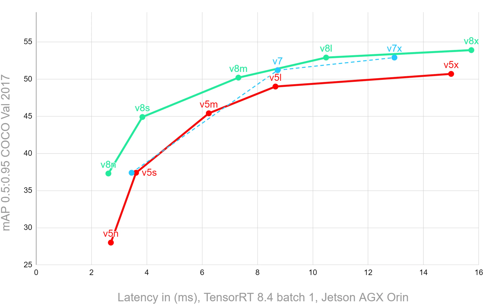
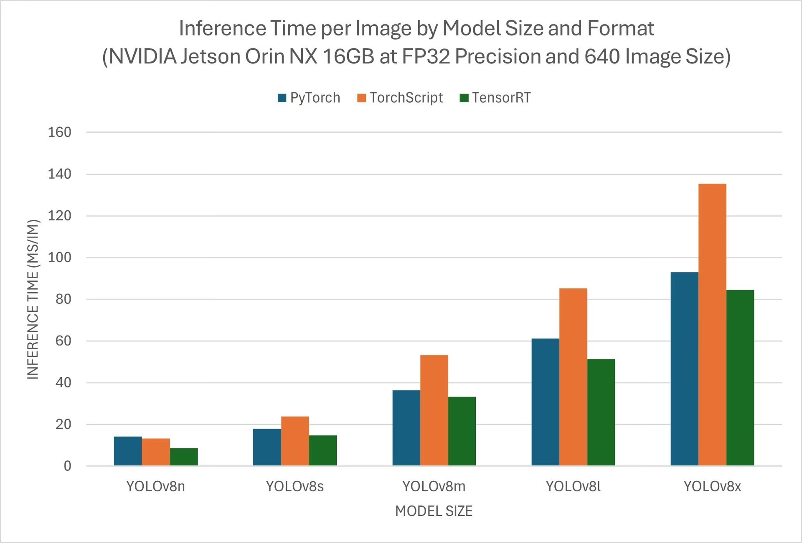
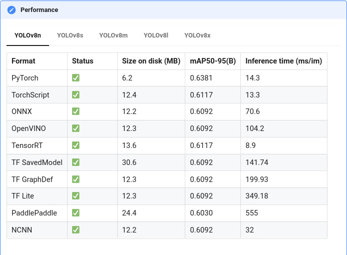
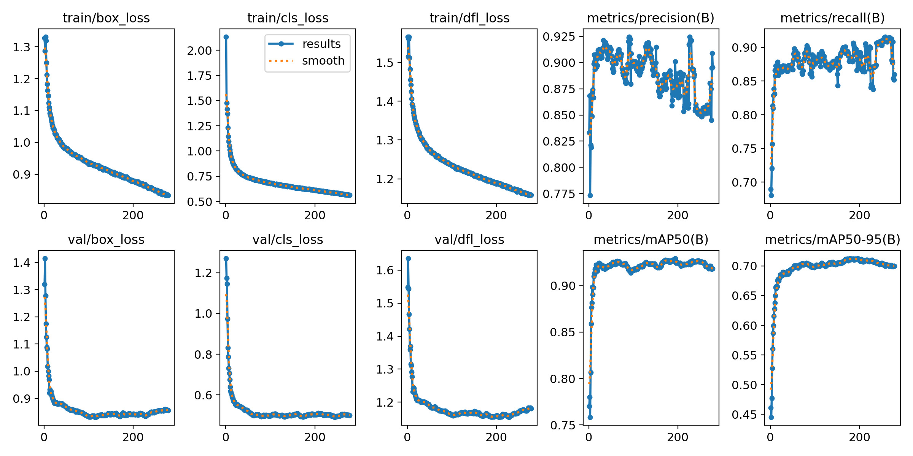
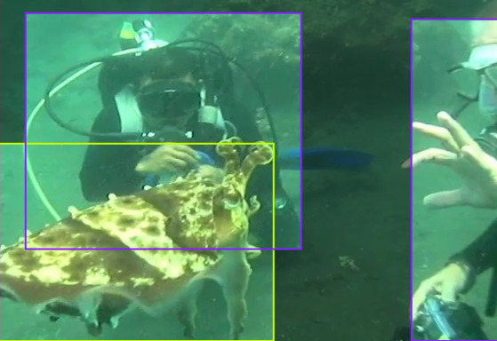
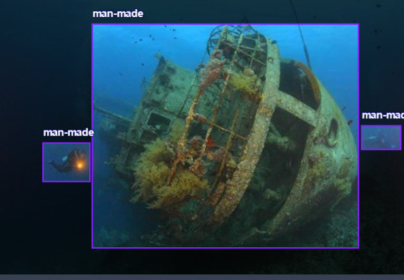
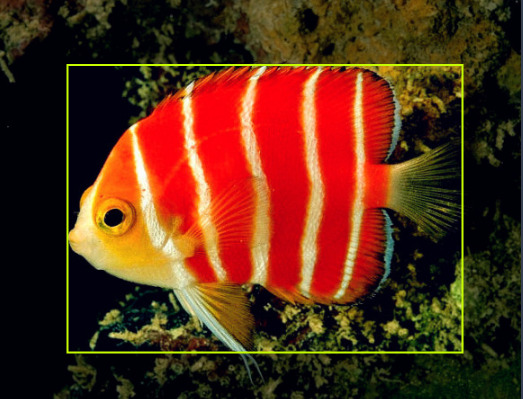

# Underwater-Object-Recognition-on-EDGE

This project focuses on detecting man-made objects in water bodies using deep learning, with applications such as underwater trash collection and shipwreck detection. The project leverages the YOLOv8 model for efficient and accurate object detection. The model was trained on a dataset annotated with images containing underwater objects and deployed on a Jetson Nano using Docker.

## Table of Contents

- [Introduction](#introduction)
- [Project Features](#project-features)
- [Dataset](#dataset)
- [Model Architecture](#model-architecture)
- [Training the Model](#training-the-model)
- [Setup and Installation](#setup-and-installation)
- [Running the Models on Jetson Nano](#running-the-models-on-jetson-nano)
- [Results](#results) 
- [Acknowledgements](#acknowledgements)

## Introduction

Underwater object detection is essential for various applications, including marine conservation, underwater exploration, and environmental cleanup. This project aims to detect and classify underwater objects using state-of-the-art deep learning techniques. The model is deployed on a Jetson Nano to allow for real-time inference in resource-constrained environments.

## Project Features

- **Object Detection**: Detects man-made objects underwater, such as trash or shipwrecks.
- **Real-Time Inference**: Runs on a Jetson Nano for efficient and portable deployments.
- **Scalable Dataset**: A dataset of 50,000 annotated images was used to train the model, providing robust performance across various underwater scenarios.

## Dataset

The dataset used for this project contains 50,000 images annotated with underwater objects. Images were annotated using Roboflow, starting with a manually annotated dataset of 100 images. The initial model was trained on this small dataset and used to annotate additional images, with manual corrections and improvements applied iteratively.

### Data Sources

- **Initial Data**: Provided by the owner of a related research paper.

  **1.** Real world underwater dataset-RUOD
  Authors: Risheng Liu, Xin Fan, Ming Zhu, Minjun Hou,Zhongxuan Luo

  **2.** Underwater  brackish [dataset](https://public.roboflow.com/object-detection/brackish-underwater/1)Format: YOLO v8, Number of Images: 14674 images

  **3.** Underwater object detection [dataset](https://universe.roboflow.com/side-kfdg0/underwater-object-detection/dataset/10)
 
  **4.** Real-world Underwater Image Enhancement [dataset](https://github.com/LehiChiang/Underwater-object-detection-dataset) (RUIE 2020).


- **Annotations**: Manually annotated with Roboflow and iteratively expanded using model-assisted labeling.
- **Custom Dataset**: You can access the custom dataset used in this project on Roboflow [here](https://app.roboflow.com/shrujana/udw/8).

## Model Architecture

The project uses the YOLOv8 model for object detection. YOLOv8 was chosen for its balance between accuracy and speed, making it suitable for deployment on resource-constrained devices like the Jetson Nano. Training was performed on a powerful lab system, with default hyperparameters used throughout the process.

### Previous Versions

- **YOLOv5 (v6.1)**: Initially used for object detection but later replaced by YOLOv8 for better performance on the Jetson Nano.

  **Yolo V5 vs V8**
  
  
  
  *Figure Source :*https://www.stereolabs.com/en-in/blog/performance-of-yolo-v5-v7-and-v8
  

  **Yolo V8 different Format comparision**
  
  <p float="left">
  
  
   *Figure Source :*https://docs.ultralytics.com/guides/nvidia-jetson
  </p>

## Training the Model

Training was performed on a lab system with the following steps:

1. Prepare the dataset in the YOLO format.
2. Train the model using the following command:
   ```bash
   yolo train data=UWD2.yaml model=yolov8.yaml epochs=1000
   ```
3. Evaluate the model on the validation set:
   ```bash
   yolo val model=best.pt data=dataset.yaml
   ```
   
  **Training Results**

   

## Setup and Installation

### Prerequisites

- **Docker**: Used to run the YOLOv8 model on Jetson Nano.
- **Ultralytics YOLOv8**: Pre-trained models and inference framework.
- **Jetson Nano**: Deployment device.

### Jetson Setup

For the initial setup of the Jetson Nano, please refer to the official Jetson Nano setup guide at the link below.

[](https://developer.nvidia.com/embedded/learn/get-started-jetson-nano-devkit)

[JetsonNanoSetup.com](https://developer.nvidia.com/embedded/learn/get-started-jetson-nano-devkit)

### Installation Steps

1. Clone the repository:
   ```bash
   git clone https://github.com/Vidhul-S/Underwater-Object-Recognition-on-EDGE
   cd underwater-object-detection
   ```

2. Pull the Docker image for Jetson Nano with JetPack 4:
   ```bash
   t=ultralytics/ultralytics:latest-jetson-jetpack4
   sudo docker pull \$t
   ```

3. Make sure your script `doc.sh` is executable:
   ```bash
   chmod +x doc.sh
   ```

4. Run the Docker container using the provided script:
   ```bash
   bash doc.sh
   ```

## Running the Models on Jetson Nano

### Step 1: Check for Existing Container

To check if the container `test1` already exists, run:
```bash
docker ps -a
```

### Step 2: Attach to the existing container

If the container exists and you know what is installed in it then start it and att to its terminal:
```bash
docker start UWD
docker attach UWD
```
skip thsi step if container doesn't exist

### Step 3: Run the Container

If the container does not exist, run the following command to start it:
```bash
bash doc.sh
```
If the container already exists, skip this step and proceed to connect to the container's terminal.

### Step 4: Initialize the New Container

In the container's terminal, update the package list and install X11 apps:
```bash
apt update
apt install x11-apps -y
```

### Step 5: Run the YOLOv8n Model

To run the YOLOv8n model in the container terminal, type:
```bash
yolo track model=yolov8n.pt source=0
```

### Step 6: Run a Custom Model

To run a custom model, upload your model weights to the `models` folder. Then, in the container terminal, type:
```bash
yolo track model="/models/<Your_Model_Name>.pt" source=0
```

### Step 7: Convert to TensorRT for Better Performance (Optional)

It is recommended to convert your model to TensorRT format (`.engine` extension) for better performance and reduced battery consumption. After conversion, your run command will look like:
```bash
yolo track model="/models/<Your_Model_Name>.engine" source=0
```

### Additional Support

- For more Docker commands and support, please refer to the [Docker Documentation](https://docs.docker.com/).
- For guidance on running and exporting YOLOv8 models, check out the [YOLOv8 Colab Tutorial](https://colab.research.google.com/drive/1Fn_dq7CJyOjGgXRXk7uHbd_yxgwle1te).

## Results

Here are some results from our underwater object detection model:

### Example 1: Underwater human


### Example 2: Detection of Shipwreck


### Example 3: Natural object


### A snip of the models effectiveness on a video


<sub>credits to DALLMYD's plane wreck exploration [video](https://www.youtube.com/watch?v=9qm5kInqZlc&t=4s)</sub>

## Acknowledgements

- Thanks to the owner of the [research paper](https://dl.acm.org/doi/10.1016/j.neucom.2022.10.039) who provided the initial dataset
- The project was developed using [Ultralytics'](https://docs.ultralytics.com) YOLO framework.
- Roboflow for the annotation tool.
- Nvidia Jetson platform and [resources](https://developer.nvidia.com/embedded/learn/get-started-jetson-nano-devkit)
- Finally Thanks to Preet Kanwal ma'am and Prasad B Honnavalli sir for providing me with resource and motivation for this undertaking 
